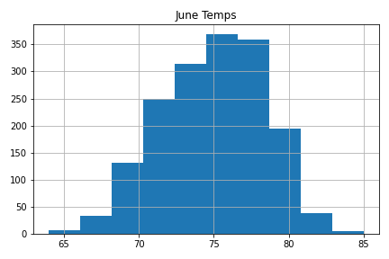
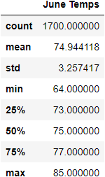
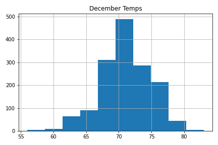

Analysis of June and December weather for Oahu,HI using SQLAlchemy to access a SQLite database of weather
## Background
W. Avy likes your analysis, but he wants more information about temperature trends before opening the surf shop. Specifically, he wants temperature data for the months of June and December in Oahu, in order to determine if the surf and ice cream shop business is sustainable year-round.
## Methodology
* Deliverable 1: Determine the Summary Statistics for June
* Deliverable 2: Determine the Summary Statistics for December
* Deliverable 3: A written report for the statistical analysis (README.md)
## Findings

### June Weather Summary
The average temperature for June in Oahu, HI is 74.9°F 
    -the highest temperature observed was 85.0 °F
    - the lowest temperature observed was 64.0 °F
    - the range of temperatures observed was 21.0°F (85-64)
 
 

 ### December Weather Summary
The average temperature for December in Oahu, HI is 71.0°F 
    -the highest temperature observed was 83.0 °F
    - the lowest temperature observed was 56.0 °F
    - the range of temperatures observed was 27.0°F (83-56)
 
 

 ### Comparison June vs. December Temperatures
The average temperature for December in Oahu, HI is 71.0°F 
* June temperatures are on average about 3°F warmer than temperatures in December
* The range of temperatures for December is greater